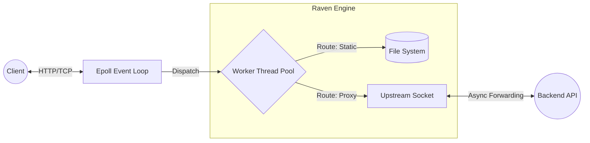

<div align="center">
  <h1>🦅 Raven Engine</h1>
  <p><strong>High-Performance, Asynchronous C++ Reverse Proxy & HTTP Server</strong></p>

  
  
  
  
  
</div>

<br />

**Raven Engine** is a high-performance, event-driven HTTP server and reverse proxy engineered from the ground up for native Linux environments. Built in modern C++17, it utilizes the POSIX `epoll` API and a custom thread-pool architecture to bypass blocking I/O, allowing it to handle concurrent client connections and stream upstream proxy traffic with near-zero latency.

Whether you're serving static assets or proxying traffic to backend microservices, Raven Engine delivers the throughput and efficiency required for modern web infrastructure.

---

## ⚡ Features

* **Event-Driven Architecture:** Utilizes edge-triggered `epoll` multiplexing to manage thousands of concurrent connections on a single thread.
* **Stateful Reverse Proxy:** Bi-directional, asynchronous streaming between clients and upstream backend servers. Fully supports fragmented packets and high-throughput data transfer.
* **Dual-Stack IP:** Seamlessly resolves and binds to both **IPv4 and IPv6** addresses using modern `getaddrinfo` resolution.
* **Asynchronous Thread Pool:** Incoming HTTP requests and proxy streams are dynamically dispatched to pre-allocated worker threads, preventing CPU blocking.
* **Keep-Alive Reaper:** A dedicated background daemon manages a priority queue to gracefully drop stale TCP connections and reclaim resources.
* **Mathematical Path Armor:** Leverages `std::filesystem::weakly_canonical` to mathematically block malicious directory traversal (e.g., `../`) attacks.
* **Macro-Driven Telemetry:** A high-performance logging engine that evaluates verbosity thresholds at compile-time to prevent string-allocation overhead in production.

---

## 🏗 Architecture Overview

Unlike traditional thread-per-connection web servers, Raven Engine mimics the highly scalable architecture of Nginx:



1. **The Event Loop:** The main thread sits entirely within `epoll_wait`, monitoring non-blocking sockets.
2. **The Handoff:** Upon receiving an `EPOLLIN` event, the main thread hands the socket FD to the Thread Pool.
3. **The Workers:** Worker threads parse the HTTP request in a stateful `Session` buffer.
4. **The Router:** Depending on the URI, the server will either efficiently stream a static file from disk or initiate a non-blocking TCP connection to a backend proxy target, registering the upstream socket back into `epoll`.

---

## 📊 Benchmarks

Raven Engine is built for speed. In our latest `v1.1.0` benchmark running on standard hardware, the server achieved highly competitive throughput for static asset delivery:

```console
$ wrk -t4 -c100 -d5s http://localhost:8080/index.html
Running 5s test @ http://localhost:8080/index.html
  4 threads and 100 connections
  Thread Stats   Avg      Stdev     Max   +/- Stdev
    Latency    35.38ms  165.15ms   1.67s    95.89%
    Req/Sec   432.34    313.53     1.54k    64.46%
  7345 requests in 5.03s, 46.15MB read
Requests/sec:   1461.28
Transfer/sec:      9.18MB
```

---

## 🚀 Getting Started

### Prerequisites
* **OS:** Linux (Ubuntu/Debian recommended)
* **Compiler:** GCC 9+ or Clang 10+ (Must support C++17)
* **Tools:** CMake 3.10+, Make

### Building from Source

```bash
git clone https://github.com/aswinganga-greenink/custom-webserver.git
cd custom-webserver

# Generate build files and compile
mkdir build && cd build
cmake ..
make -j$(nproc)

# Run the server
cd ..
./build/webserver server.conf
```

### Configuration (`server.conf`)

Raven Engine is highly configurable via a simple key-value `server.conf` file:

```ini
# Core Configuration
port = 8080
worker_threads = 4
document_root = public
log_level = DEBUG

# Reverse Proxy Configuration
proxy_route = /api
proxy_target_ip = 127.0.0.1
proxy_target_port = 3000
```

* **`document_root`**: Path to your static files, evaluated relative to the execution directory.
* **`proxy_route`**: Any URI beginning with this path will be hijacked and forwarded to the backend.
* **`proxy_target_ip`**: The IPv4 or IPv6 address of your backend microservice.

---

## 🐳 Deployment via Docker

Raven Engine is packaged as a multi-stage, immutable Docker container. For active development, use volume mounts to enable live-reloading of assets without recompiling the binary.

```bash
# 1. Build the lightweight image
docker build -t raven-engine:v1.1.0 .

# 2. Run with live volume mounts
docker run -d \
  --name raven-server \
  -p 8080:8080 \
  -v $(pwd)/server.conf:/app/server.conf \
  -v $(pwd)/public:/app/public \
  raven-engine:v1.1.0
```

---

## 🧪 Testing

The engine is equipped with a rigorous `gtest` suite covering HTTP parsing, configuration loading, and stateful socket logic.

```bash
cd build
make server_tests
ctest -V
```

---

## 📜 License

Distributed under the MIT License. See `LICENSE` for more information.